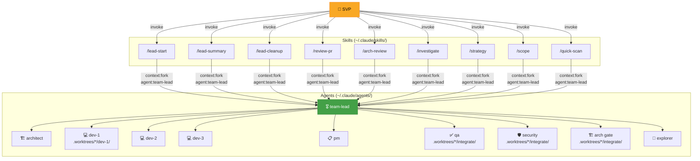

# Claude Code — SVP Engineering Setup v5

Skills + Agents architecture. All Opus 4.6. Git worktree isolation. Stateful tasks.

## What Changed (v4 → v5)

| v4 (deprecated) | v5 |
|---|---|
| `~/.claude/commands/*.md` | `~/.claude/skills/*/SKILL.md` |
| Commands = user-invoked only | Skills = `/name` or auto-triggered by Claude |
| Flat markdown files | Folders with YAML frontmatter + supporting files |
| Runs in main context | `context: fork` + `agent: team-lead` = isolated execution |

Your old `~/.claude/commands/` still work but are deprecated. Skills are the official path forward.

## Install

```bash
chmod +x install.sh && ./install.sh
```

## Architecture



**How it works:**
1. SVP invokes a skill (e.g., `/lead-start --devs 3 implement OAuth2 PKCE`)
2. Skill forks into isolated context with `agent: team-lead`
3. team-lead orchestrates specialist agents through the pipeline
4. Each agent works in git worktrees and writes status to `.claude/tasks/`

## File Layout

```
~/.claude/
├── settings.json
├── CLAUDE.md                         ← global context
├── agents/
│   ├── team-lead.md                  ← orchestrator
│   ├── architect.md                  ← design + gate
│   ├── dev.md                        ← TDD worker (×1-5)
│   ├── qa.md                         ← e2e tester
│   ├── security-reviewer.md          ← security gate
│   ├── pm.md                         ← requirements
│   └── explorer.md                   ← scout
└── skills/
    ├── lead-start/SKILL.md           ← start or resume task
    ├── lead-summary/SKILL.md         ← progress overview
    ├── lead-cleanup/SKILL.md         ← remove worktrees
    ├── review-pr/SKILL.md            ← PR review
    ├── arch-review/SKILL.md          ← architecture audit
    ├── investigate/SKILL.md          ← incident investigation
    ├── strategy/SKILL.md             ← strategic decisions
    ├── scope/SKILL.md                ← project scoping
    └── quick-scan/SKILL.md           ← health check
```

## Skill Frontmatter

Every skill uses:

```yaml
---
name: lead-start
description: >
  When Claude should trigger this skill automatically.
disable-model-invocation: true    # only /slash invocation, not auto
context: fork                     # isolated execution
agent: team-lead                  # delegate to team-lead agent
---
```

- `disable-model-invocation: true` — Claude won't auto-trigger; only `/lead-start` works
- `context: fork` — runs in isolated subagent (doesn't pollute main conversation)
- `agent: team-lead` — uses the team-lead agent definition for execution

## Skills Reference

| Skill | Trigger | What it does |
|-------|---------|------|
| `/lead-start [--devs N] <task>` | Start/resume | Creates task folder, worktrees, runs full pipeline |
| `/lead-summary [focus]` | Status | Scans all tasks, reports progress + blockers |
| `/lead-cleanup <slug>` | After merge | Removes worktrees + branches |
| `/review-pr <context>` | PR review | Dev → peer → QA → security → arch gate |
| `/arch-review <focus>` | Arch audit | Explorer → architect → security → PM |
| `/investigate <issue>` | Incident | Logs → root cause → blast radius → fix |
| `/strategy <decision>` | Decisions | PM → architect → security → recommendation |
| `/scope <project>` | Planning | MoSCoW → design → security → go/no-go |
| `/quick-scan [focus]` | Health check | Structure → tests → quality |

### `--devs N` Examples

```bash
/lead-start --devs 3 implement OAuth2 PKCE with MFA    # 3 parallel devs
/lead-start --devs 1 fix auth token refresh bug         # single dev, no peer review
/lead-start implement payment processing refactor       # architect decides N
/lead-start oauth2-pkce-with-mfa                        # resume existing task
```

## Pipeline

```
Plan → Build (TDD ×N, worktrees) → Peer Review → Merge → QA e2e → Gate → Done
```

| Phase | Who | Where | Output |
|-------|-----|-------|--------|
| Plan | pm + architect | main repo | `pm.md`, `architect.md` |
| Build (TDD) | dev ×N parallel | `.worktrees/{slug}/dev-{N}/` | `dev-{N}.md` |
| Peer Review | devs cross-review | each other's worktrees | `peer-review.md` |
| Merge | team-lead | → `.worktrees/{slug}/integrate/` | merge commits |
| QA | qa | `.worktrees/{slug}/integrate/` | `qa.md` |
| Gate | security + architect | `.worktrees/{slug}/integrate/` | `security.md`, `arch-gate.md` |
| Report | team-lead | main repo | `summary.md` |

## Task State

```
your-project/
├── .claude/
│   └── tasks/
│       └── oauth2-pkce/
│           ├── _status.md          ← source of truth
│           ├── pm.md               ← requirements
│           ├── architect.md        ← design + areas
│           ├── dev-1.md … dev-3.md ← TDD reports
│           ├── peer-review.md      ← cross-review
│           ├── qa.md               ← e2e results
│           ├── security.md         ← security gate
│           ├── arch-gate.md        ← arch gate
│           └── summary.md          ← executive summary
└── .worktrees/
    └── oauth2-pkce/
        ├── dev-1/              ← branch: oauth2-pkce/dev-1
        ├── dev-2/              ← branch: oauth2-pkce/dev-2
        ├── dev-3/              ← branch: oauth2-pkce/dev-3
        └── integrate/          ← branch: oauth2-pkce/integrate
```

## Resume Flow

```
SVP: /lead-start oauth2-pkce
  ↓
team-lead reads .claude/tasks/oauth2-pkce/_status.md
  ↓
Phase: BUILD, 2/3 devs done
  ↓
Reads pm.md, architect.md, dev-1.md, dev-2.md
  ↓
"Resuming BUILD — starting dev-3 (auth middleware)"
  ↓
dev works in .worktrees/oauth2-pkce/dev-3/
```

## Permissions

| ✅ Auto-approved | 🚫 Blocked |
|---|---|
| Read, Write, Edit, Glob, Grep, Skill | .env / .pem / .key files |
| git, kubectl get/logs, docker ps/logs | rm -rf, sudo |
| terraform plan/show | kubectl delete/apply |
| cargo test, go test, rspec, vitest | terraform apply/destroy |
| | docker rm, helm upgrade/uninstall |

## Uninstall

```bash
rm -rf ~/.claude/agents ~/.claude/skills
rm -f ~/.claude/settings.json ~/.claude/CLAUDE.md
# Restore backups if they exist
mv ~/.claude/settings.json.bak ~/.claude/settings.json 2>/dev/null
mv ~/.claude/CLAUDE.md.bak ~/.claude/CLAUDE.md 2>/dev/null
# Old commands (if still present)
rm -rf ~/.claude/commands/
```

`.claude/tasks/` folders in your projects are kept — they're your documentation.
