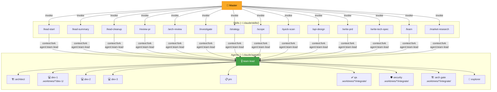

# Claude Code — Master Engineering Setup v6

Skills + Agents architecture. Git worktree isolation. Stateful tasks.

## What Changed

### v5 → v6

| v5                                       | v6                                                        |
| ---------------------------------------- | --------------------------------------------------------- |
| claude-squad optional install            | RTK (Rust Token Killer) auto-install for 60-90% token savings |
| 12 skills (9 pipeline + 3 team)          | 17 skills (+`/api-design`, `/write-prd`, `/write-tech-spec`, `/learn`, `/market-research`) |
| `--revert` only                          | `--revert`, `--dry-run`, `--yes` flags                    |

### v4 → v5

| v4 (deprecated)              | v5                                                        |
| ---------------------------- | --------------------------------------------------------- |
| `~/.claude/commands/*.md`    | `~/.claude/skills/*/SKILL.md`                             |
| Commands = user-invoked only | Skills = `/name` or auto-triggered by Claude              |
| Flat markdown files          | Folders with YAML frontmatter + supporting files          |
| Runs in main context         | `context: fork` + `agent: team-lead` = isolated execution |
| settings.json full overwrite | jq deep merge (user values preserved)                     |
| Appends to CLAUDE.md         | Separate `rules/kit/CLAUDE-kit.md` (auto-loaded)          |
| Manual uninstall             | `./install.sh --revert` one-click restore                 |

Your old `~/.claude/commands/` still work but are deprecated. Skills are the official path forward.

## Install

```bash
chmod +x install.sh && ./install.sh
```

Requires `jq` (auto-installed by the script if missing), Node.js/npm, and the Claude Code CLI. RTK and `@owloops/claude-powerline` are auto-installed during setup.

### Flags

| Flag | Description |
|------|-------------|
| `--revert` | One-click uninstall: removes kit files, restores backups |
| `--dry-run` | Preview what would change without modifying any files |
| `--yes` | Auto-approve all prompts (non-interactive install) |

### Uninstall

```bash
./install.sh --revert
```

This reads the manifest, deletes all kit-created files, restores backups from `~/.claude/.kit-backup/`, and strips any legacy markers from CLAUDE.md.

`.claude/tasks/` folders in your projects are kept — they're your documentation.

### Everything Claude Code Plugin

```bash
# Add marketplace
/plugin marketplace add affaan-m/everything-claude-code

# Install plugin
/plugin install everything-claude-code@everything-claude-code

# Clone the repo first
git clone https://github.com/affaan-m/everything-claude-code.git
cd everything-claude-code
./install.sh typescript python golang
```

## Architecture


```mermaid
flowchart TB
    Master["👤 Master"]

    subgraph "Skills (~/.claude/skills/)"
        LS["/lead-start"]
        LSM["/lead-summary"]
        LC["/lead-cleanup"]
        RP["/review-pr"]
        AR["/arch-review"]
        INV["/investigate"]
        STR["/strategy"]
        SC["/scope"]
        QS["/quick-scan"]
        AD["/api-design"]
        WP["/write-prd"]
        WTS["/write-tech-spec"]
        LN["/learn"]
        MR["/market-research"]
    end

    subgraph "Agents (~/.claude/agents/)"
        TL["🎖 team-lead"]
        ARCH["🏗 architect"]
        D1["💻 dev-1\n.worktrees/*/dev-1/"]
        D2["💻 dev-2"]
        D3["💻 dev-3"]
        PM["📋 pm"]
        QA["✅ qa\n.worktrees/*/integrate/"]
        SEC["🛡 security\n.worktrees/*/integrate/"]
        AG["🏗 arch gate\n.worktrees/*/integrate/"]
        EXP["🔭 explorer"]
    end

    Master -->|"invoke"| LS & LSM & LC & RP & AR & INV & STR & SC & QS & AD & WP & WTS & LN & MR
    LS & LSM & LC & RP & AR & INV & STR & SC & QS & AD & WP & WTS & LN & MR -->|"context:fork\nagent:team-lead"| TL
    TL --> ARCH & D1 & D2 & D3 & PM & QA & SEC & AG & EXP

    style Master fill:#f9a825,stroke:#f57f17,color:#000
    style TL fill:#43a047,stroke:#2e7d32,color:#fff
```

**How it works:**

1. Master invokes a skill (e.g., `/lead-start --devs 3 implement OAuth2 PKCE`)
2. Skill forks into isolated context with `agent: team-lead`
3. team-lead orchestrates specialist agents through the pipeline
4. Each agent works in git worktrees and writes status to `.claude/tasks/`

## File Layout

```
~/.claude/
├── settings.json                     ← merged with kit defaults (user values win)
├── powerline.json                    ← claude-powerline config
├── CLAUDE.md                         ← global context (kit adds @reference only)
├── rules/
│   └── kit/
│       └── CLAUDE-kit.md             ← kit docs (auto-loaded by Claude Code)
├── agents/
│   ├── team-lead.md                  ← orchestrator
│   ├── architect.md                  ← design + gate
│   ├── dev.md                        ← TDD worker (×1-5)
│   ├── qa.md                         ← e2e tester
│   ├── security-reviewer.md          ← security gate
│   ├── pm.md                         ← requirements
│   └── explorer.md                   ← scout
├── skills/
│   ├── lead-start/SKILL.md           ← start or resume task
│   ├── lead-summary/SKILL.md         ← progress overview
│   ├── lead-cleanup/SKILL.md         ← remove worktrees
│   ├── review-pr/SKILL.md            ← PR review
│   ├── arch-review/SKILL.md          ← architecture audit
│   ├── investigate/SKILL.md          ← incident investigation
│   ├── strategy/SKILL.md             ← strategic decisions
│   ├── scope/SKILL.md                ← project scoping
│   ├── quick-scan/SKILL.md           ← health check
│   ├── team-start/SKILL.md           ← spawn agent team (tmux)
│   ├── team-status/SKILL.md          ← check team progress
│   ├── team-stop/SKILL.md            ← cleanup team
│   ├── api-design/SKILL.md           ← REST API design patterns
│   ├── write-prd/SKILL.md            ← product requirements document
│   ├── write-tech-spec/SKILL.md      ← technical specification
│   ├── learn/SKILL.md                ← extract reusable patterns
│   └── market-research/SKILL.md      ← competitive analysis & research
├── .kit-manifest                     ← tracks all created/modified files
└── .kit-backup/                      ← pre-install backups
```

## Settings Merge Strategy

The installer uses `jq` deep merge instead of overwriting `settings.json`. Kit defaults serve as the base; your existing values are overlaid on top.

| Field type | Strategy |
|-----------|----------|
| Scalars (`model`, `cleanupPeriodDays`) | Kit provides defaults; user value wins if present |
| Objects (`env`, `hooks`) | Deep merge; user values win per key |
| Arrays (`permissions.allow`, `permissions.deny`) | Union + deduplicate |

Three-stage validation ensures the output is always valid JSON:

1. **Pre-merge** — validates `KIT_DEFAULTS` before any operation
2. **Post-merge** — validates the jq merge output before writing
3. **Final gate** — validates the on-disk file; restores backup on failure

## Backup & Revert

Every install creates a manifest (`~/.claude/.kit-manifest`) tracking all files created or modified. Pre-existing files are backed up to `~/.claude/.kit-backup/`.

```bash
./install.sh --revert    # one-click restore
```

Revert reads the manifest to:
- Delete all kit-created files (`agents/`, `skills/`, `rules/kit/`, `powerline.json`)
- Restore backed-up files (`settings.json`, `CLAUDE.md`) from `.kit-backup/`
- Strip legacy CLAUDE.md markers if found from previous installs
- Clean up empty directories, manifest, and backup dir

## Skill Frontmatter

Most pipeline skills use forked execution:

```yaml
---
name: lead-start
description: >
  When Claude should trigger this skill automatically.
disable-model-invocation: true # only /slash invocation, not auto
context: fork # isolated execution
agent: team-lead # delegate to team-lead agent
---
```

- `disable-model-invocation: true` — Claude won't auto-trigger; only `/lead-start` works
- `context: fork` — runs in isolated subagent (doesn't pollute main conversation)
- `agent: team-lead` — uses the team-lead agent definition for execution

**Exception**: `/team-start` executes directly in the main session (no fork) to ensure proper tmux pane creation via `TeamCreate` tool.

## Skills Reference

### Pipeline Skills

| Skill                           | Trigger      | What it does                                       |
| ------------------------------- | ------------ | -------------------------------------------------- |
| `/lead-start [--devs N] <task>` | Start/resume | Creates task folder, worktrees, runs full pipeline |
| `/lead-summary [focus]`         | Status       | Scans all tasks, reports progress + blockers       |
| `/lead-cleanup <slug>`          | After merge  | Removes worktrees + branches                       |
| `/review-pr <context>`          | PR review    | Dev → peer → QA → security → arch gate             |
| `/arch-review <focus>`          | Arch audit   | Explorer → architect → security → PM               |
| `/investigate <issue>`          | Incident     | Logs → root cause → blast radius → fix             |
| `/strategy <decision>`          | Decisions    | PM → architect → security → recommendation         |
| `/scope <project>`              | Planning     | MoSCoW → design → security → go/no-go              |
| `/quick-scan [focus]`           | Health check | Structure → tests → quality                        |

### Document Skills

| Skill                           | Trigger        | What it does                                       |
| ------------------------------- | -------------- | -------------------------------------------------- |
| `/api-design`                   | API design     | REST patterns: naming, status codes, pagination, versioning |
| `/write-prd`                    | PRD creation   | Product requirements document with template        |
| `/write-tech-spec`              | Tech spec      | Technical specification document with template     |
| `/learn`                        | Pattern extraction | Extract reusable patterns from current session  |
| `/market-research`              | Research       | Market sizing, competitive analysis, investor diligence |

### Agent Team Skills

| Skill                                 | Trigger        | What it does                                      |
| ------------------------------------- | -------------- | ------------------------------------------------- |
| `/team-start [--agents a,b,c] <task>` | Spawn team     | Creates tmux panes with parallel Claude instances |
| `/team-status <team-name>`            | Check progress | Shows member status, tasks, messages              |
| `/team-stop <team-name>`              | Cleanup        | Terminates team and removes resources             |

#### `/team-start` Examples

```bash
/team-start --agents pm,architect,explorer standby   # 3 agents in tmux, waiting
/team-start --agents dev,dev,dev my-feature          # 3 devs for parallel work
/team-start --members 3 standby                      # 3 generic teammates
```

### `--devs N` Examples

```bash
/lead-start --devs 3 implement OAuth2 PKCE with MFA    # 3 parallel devs
/lead-start --devs 1 fix auth token refresh bug         # single dev, no peer review
/lead-start implement payment processing refactor       # architect decides N
/lead-start oauth2-pkce-with-mfa                        # resume existing task
```

## Pipeline

```
Plan → Build (TDD ×N, worktrees) → Peer Review → Merge → QA e2e → Gate → Done
```

| Phase       | Who                  | Where                            | Output                        |
| ----------- | -------------------- | -------------------------------- | ----------------------------- |
| Plan        | pm + architect       | main repo                        | `pm.md`, `architect.md`       |
| Build (TDD) | dev ×N parallel      | `.worktrees/{slug}/dev-{N}/`     | `dev-{N}.md`                  |
| Peer Review | devs cross-review    | each other's worktrees           | `peer-review.md`              |
| Merge       | team-lead            | → `.worktrees/{slug}/integrate/` | merge commits                 |
| QA          | qa                   | `.worktrees/{slug}/integrate/`   | `qa.md`                       |
| Gate        | security + architect | `.worktrees/{slug}/integrate/`   | `security.md`, `arch-gate.md` |
| Report      | team-lead            | main repo                        | `summary.md`                  |

## Task State

```
your-project/
├── .claude/
│   └── tasks/
│       └── oauth2-pkce/
│           ├── _status.md          ← source of truth
│           ├── pm.md               ← requirements
│           ├── architect.md        ← design + areas
│           ├── dev-1.md … dev-3.md ← TDD reports
│           ├── peer-review.md      ← cross-review
│           ├── qa.md               ← e2e results
│           ├── security.md         ← security gate
│           ├── arch-gate.md        ← arch gate
│           └── summary.md          ← executive summary
└── .worktrees/
    └── oauth2-pkce/
        ├── dev-1/              ← branch: oauth2-pkce/dev-1
        ├── dev-2/              ← branch: oauth2-pkce/dev-2
        ├── dev-3/              ← branch: oauth2-pkce/dev-3
        └── integrate/          ← branch: oauth2-pkce/integrate
```

## Resume Flow

```
Master: /lead-start oauth2-pkce
  ↓
team-lead reads .claude/tasks/oauth2-pkce/_status.md
  ↓
Phase: BUILD, 2/3 devs done
  ↓
Reads pm.md, architect.md, dev-1.md, dev-2.md
  ↓
"Resuming BUILD — starting dev-3 (auth middleware)"
  ↓
dev works in .worktrees/oauth2-pkce/dev-3/
```

## Permissions

| ✅ Auto-approved                      | 🚫 Blocked                        |
| ------------------------------------- | --------------------------------- |
| Read, Write, Edit, Glob, Grep, Skill  | .env / .pem / .key files          |
| git, kubectl get/logs, docker ps/logs | rm -rf, sudo                      |
| terraform plan/show                   | kubectl delete/apply              |
| cargo test, go test, rspec, vitest    | terraform apply/destroy           |
| mcp\_\_pencil, rtk, fd               | docker rm, helm upgrade/uninstall |
