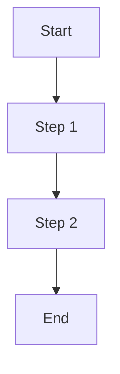

# write-prd

Write a Product Requirements Document (PRD) using the standard template.

## Instructions

When the user asks you to write a PRD, follow these steps:

1. **Gather context**: Ask the user about the feature/product they want to document. Collect key information such as:
   - What problem are they solving?
   - Who are the stakeholders?
   - What are the success metrics?
   - What is the scope and timeline?
   - Any existing research or competitor analysis?

2. **Research the codebase and resources**: If the feature relates to the current codebase, use Explore agents to understand the existing architecture, relevant files, and patterns. Search Confluence and Jira for related documentation if applicable.

3. **Generate the PRD**: Fill in the template below with the gathered information. Replace placeholder comments with actual content. Use clear, concise language.

4. **Output**: Write the PRD to a file the user specifies, or output it directly. Default filename: `docs/prd/<feature-name>-prd.md`.

## PRD Template

```markdown
# PRD Template

## Stakeholders

| Role | Owner |
|---|---|
| **Target release** | |
| **Epic** | |
| **Document status** | |
| **Business Owner** | |
| **Document owner** | |
| **Product** | |
| **Designer** | |
| **Backends** | |
| **Frontend Devs** | |
| **Tech Spec** | |
| **QA** | |
| **Growth - CRM** | |
| **Product Analytics** | |
| **Security** | |

## PRD Edit Log

| Date | Updated by | Change |
|---|---|---|
|   |   |   |

---

## 1. Background

> Current pain points / issue, objectives, description of feature to be built

### 1.1 What problem are we solving?

<!-- Describe the problem clearly -->

### 1.2 Existing resources

<!-- Links to related docs, designs, tech specs -->

---

## 2. Research

### 2.1 Competitor research

<!-- Competitor analysis and benchmarking -->

---

## 3. Success Metrics

| Priority | Goal | Metric | Target |
|---|---|---|---|
| P0 | | | |
| P1 | | | |

---

## 4. Approach & Scope

### 4.1 Scope

> Scope of product / feature requirements - What to build

### 4.2 Timeline

<!-- Milestones and dates -->

### 4.3 Flowchart



---

## 5. Requirements

### 5.1 Feature category

<!-- List feature requirements here -->

---

## 6. User Stories

### 6.1 Feature category

#### 6.1.1 User Story

- User stories must comes with Given-When-Then style

| Field | Details |
|---|---|
| **ID - Jira Ticket** | |
| **Involvement** | |
| **User Story** | |
| **Priority** | |
| **Acceptance Criteria** | |
| **Design** | |
| **Notes** | |

---

## 7. Implementation of A/B Testing and Event Tracking

> The feature will only be released to specified user personas configured in Firebase, and the actions taken by users would also be tracked by using Firebase and Segment Event Tracking.

### 7.1 Event Tracking

| Field | Details |
|---|---|
| **ID - Jira Ticket** | |
| **User Story** | As an internal user, I want to implement A/B testing of the above features and have event tracking on both Firebase (for testing) and Segment (for analysis) |
| **Priority** | Must-have |
| **Acceptance Criteria** | The tracking plan is as below: Add link to event tracking sheet |
| **Notes** | |
```

## Guidelines

- Always use **Given-When-Then** format for user stories
- Prioritize requirements as P0 (must-have), P1 (should-have), P2 (nice-to-have)
- Include mermaid flowcharts where appropriate to visualize user flows
- Link to Jira tickets and Confluence pages when available
- Fill in stakeholder roles based on what the user provides; leave blank if unknown
- Set the document status to "Draft" initially
